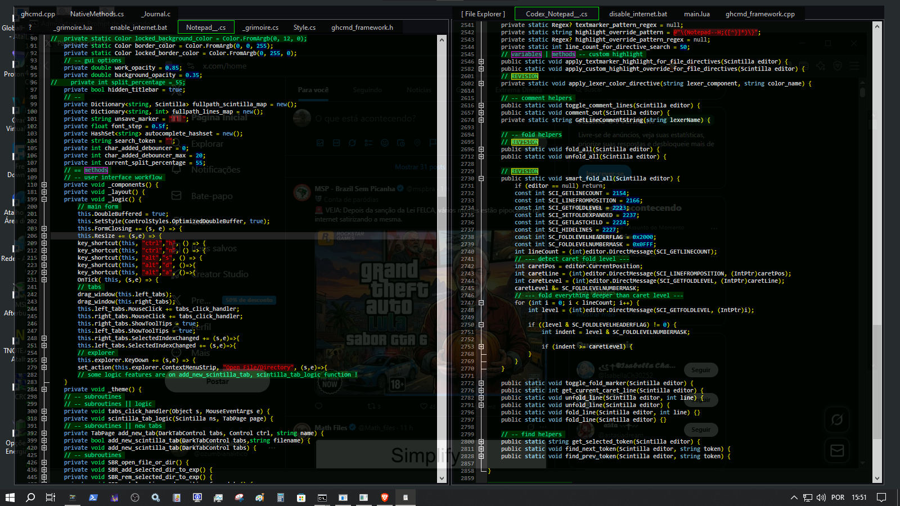

# Notepad--

A slop and much lesser version of Notepad++, don't like it? Use Notepad++ instead.

Build on top of winforms and Scintilla5.NET ( https://github.com/desjarlais/Scintilla.NET ).

## Features--
1. Fixed Dark Theme. I don't care about your bad taste, it's hardcoded.
2. Has less language support. Just use a normal programming language, like a normal person.
3. Lot of commands using keyboard shortcuts instead of a proper user interface. Never played a game? Are u a boomer?  
4. Beeps and Boops Sounds on some keybinds. Don't know why, it's vibecoded ...
5. It's under self-development. I use this editor to build better versions of this editor, if something happens to this repo the development ends.

## Actual Features:
1. Translucent Minimalist Dark Theme.
2. Syntax Highlighting and Special Text Marker Highlighting for custom keywords.
3. Autocompletion.
4. Partial theme configuration by comment directives per file.
5. Embedded minimal file explorer using treeview.
6. No internet connection and no auto-update. (I never will, it's a text editor)

It's under active development, so expect some bugs.  

I recommend to "self-audit" those files using A.I., the project is simple and almost finished, so the file size will be is pretty much the same (~ 4K lines). Ask for risks or vulnerabilities before using it.

## Installation 
1. Download .NET 10 at https://dotnet.microsoft.com/download
2. Install .NET SDK
3. Download this repository
4. Extract the contents of this repository
5. Run the batch script release.bat to compile
6. go to binary folder and open the program

## Usage

1. Open the Executable you just compiled.
2. It will start on compact mode by default, use Ctrl+H to switch.
3. You can navigate through you windows filesystem using the [ File Explorer ]
4. Try to navigate to this directory and press enter to open some of .cs files from this project.
5. Use Ctrl+R to switch between readonly and edition modes. It starts readonly by default.

## Source Description:
1. CODEX_Notepad__.cs : Codex is the framework library, mainly generated with AI assistance (Vibecoding). I use the term "codex" way before ChatGPT, "codex" stands for "magical spell codex", a framework for magic helper functions generated or not by A.I. 
2. GOLEM_Notepad__.cs : Is the "hardcoded" part, where I used my low I.Q. "chimpanzee" brain to organize the code and setup the logic. Golems are mainly handmade code.
3. The other files I don't mess up, was generated by winforms template by .NET framework.

## Experimental 
This project have some experimental plugins. Currently there is just one module available.
1. [ghcmd.exe](https://github.com/EYO-07/ghcmd) : Global Hotkeys Module, when active this module creates global hotkeys to move mouse from numpad keyboard using (numpad 5,numpad 1,numpad 2,numpad 3) to move the mouse (up,left,down,right), (numpad 4, numpad 6) to remap mouse buttons, and hotkeys to resize and change position of any active window. Follow the instructions to compile the ghcmd.exe, create a folder named `modules` where you find the Notepad--.exe, put ghcmd.exe on this folder and restart the Notepad--.exe. 
