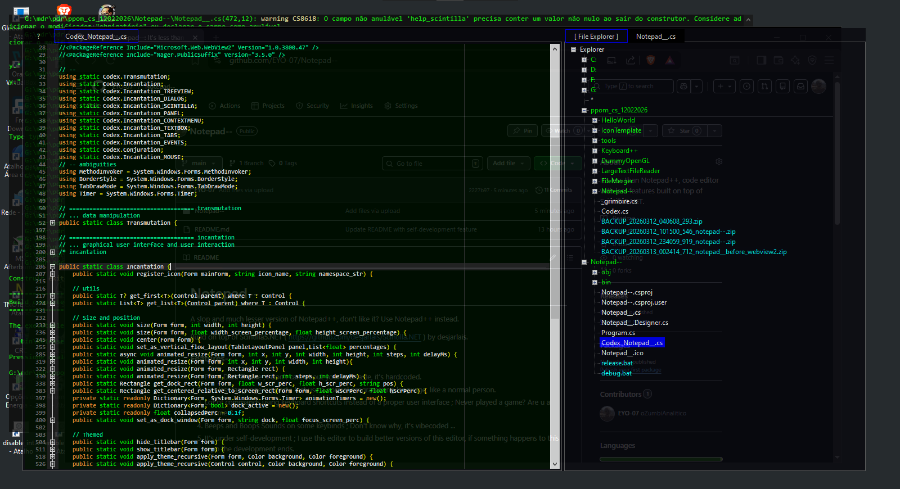

# Notepad--

A slop and much lesser version of Notepad++, don't like it? Use Notepad++ instead.

Build on top of Scintilla5.NET ( https://github.com/desjarlais/Scintilla.NET ) by desjarlais.

## Features--
1. Fixed Dark Theme. I don't care about your bad taste, it's hardcoded.
2. Has less language support. Just use a normal programming language, like a normal person.
3. Lot of commands using keyboard shortcuts instead of a proper user interface. Never played a game? Are u a boomer?  
4. Beeps and Boops Sounds on some keybinds. Don't know why, it's vibecoded ...
5. It's under self-development. I use this editor to build better versions of this editor, if something happens to this repo the development ends.

## Installation 
1. Download .NET 10 at https://dotnet.microsoft.com/download
2. Install .NET SDK
3. Download this repository
4. Extract the contents of this repository
5. Run the batch script release.bat to compile
6. go to binary folder and open the program

## Usage

1. Open the Executable you just compiled.
2. It will start on compact mode by default, use Ctrl+H to switch.
3. You can navigate through you windows filesystem using the [ File Explorer ]
4. Try to navigate to this directory and press enter to open some of .cs files from this project.

## Source Description:
1. Codex_Notepad__.cs : Codex is the framework library, mainly generated with AI assistance (Vibecoding). I use the term "codex" way before ChatGPT, "codex" stands for "magical spell codex", a framework for magic helper functions generated or not by A.I. 
2. Notepad__.cs : Is the "hardcoded" part, where I used my low I.Q. "chimpanzee" brain to organize the code and setup the logic.
3. The other files I don't mess up, was generated by winforms template by .NET framework.
